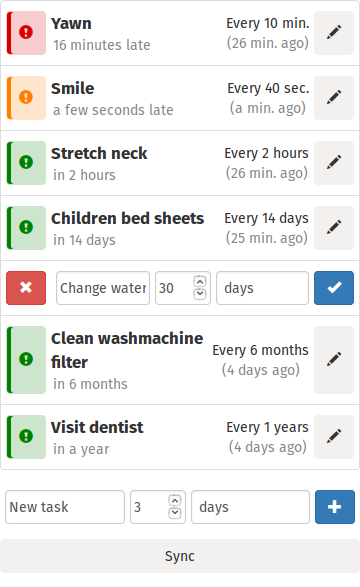

# Routina

> Periodical tasks, rescheduled when checked.

**Routina** is a *todo list* where the tasks have a period and are
automatically rescheduled when marked as done.

It works offline.

You can use it [in your browser](https://leplatrem.github.io/Routina/) or [install it as an app](https://leplatrem.github.io/Routina/install.html) (*Firefox Desktop/Android/OS*)!

## Roadmap

* Firefox Account [login](https://github.com/Kinto/kinto-react-boilerplate/pull/16) (#2) and [Firefox OS integration](https://developer.mozilla.org/en-US/docs/Firefox-Accounts-on-FirefoxOS) (#13)
* Synchronize automatically when user is online (#4)
* [Notifications API](https://developer.mozilla.org/en-US/docs/Web/API/Notifications_API) (#16)
* [Alarm API](https://developer.mozilla.org/en-US/docs/Web/API/Alarm_API) notifications (#17)
* Settings page to control remote server and options (#15)
* Encrypt data before sync (#14)

## Hack

Development

* ``npm install``: Install dependencies
* ``npm start``: Run app locally (with autorefresh)
* ``npm test``: Run tests

Production

* ``npm run build``: Package every assets for production
* ``npm run package``: Open Web app package

## Credits

Original idea by [Elisenda](http://github.com/elisenda/).

* Clock by [Micthev](https://commons.wikimedia.org/wiki/File:Clock_02-30.svg), CC-BY-SA
* Mouse by [Xfce Team](https://commons.wikimedia.org/wiki/File:Xfce_logo-footprint.svg), CC-BY-SA

This application is based on the [Kinto React boilerplate](https://github.com/Kinto/kinto-react-boilerplate).

Data is synchronized on the [Mozilla Kinto demo server](http://kinto.readthedocs.org).

## License

* Apache License Version 2.0
